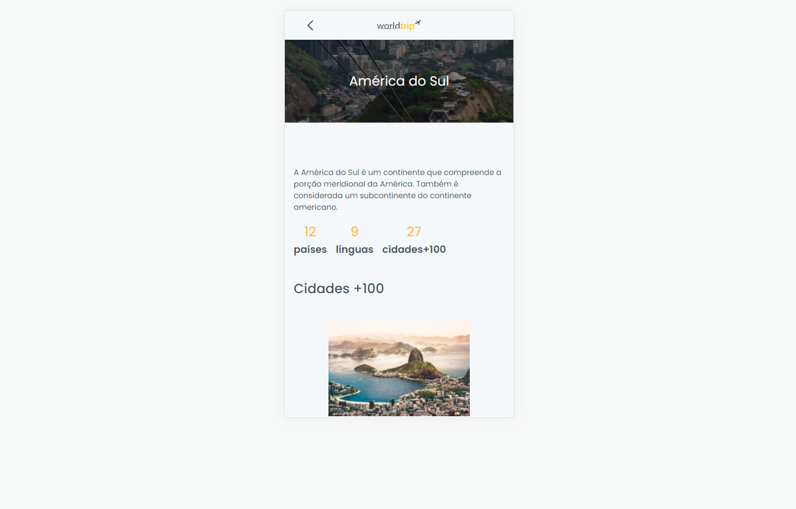

<p align="center" style="background: #fff">
  
</p>

<h1 align="center">
🚧 WorldTrip 🚧
</h1>

<p align="center">
  

  

  <a href="https://github.com/alfredots/letmeask/commits/main">
    
  </a>

  <a href="https://github.com/alfredots/FindHouses/issues">
    
  </a>

  
</p>

<p align="center">
  <a href="#-projeto">Projeto</a>&nbsp;&nbsp;&nbsp;|&nbsp;&nbsp;&nbsp;
    <a href="#rocket-requisitos">Requisitos</a>&nbsp;&nbsp;&nbsp;|&nbsp;&nbsp;&nbsp;
  <a href="#rocket-tecnologias">Tecnologias</a>&nbsp;&nbsp;&nbsp;|&nbsp;&nbsp;&nbsp;
  <a href="#rocket-aprendizado">Aprendizado</a>&nbsp;&nbsp;&nbsp;|&nbsp;&nbsp;&nbsp;
  <a href="#rocket-comandos">Comandos</a>&nbsp;&nbsp;&nbsp;|&nbsp;&nbsp;&nbsp;
  <a href="#rocket-layout">Layout</a>&nbsp;&nbsp;&nbsp;|&nbsp;&nbsp;&nbsp;
  <a href="#memo-licença">Licença</a>
</p>
<br>

## 💻 Projeto
---
Esse projeto foi desenvolvido com o objetivo de desenvolver as habilidades com Chakra UI.

### Home
---


### Post
---



## ❗ Requisitos
---
- Você precisa instalar [Node.js](https://nodejs.org/en/download/) e [Yarn](https://yarnpkg.com/) para executar este projeto.
## ✈️ Tecnologias
---
Esse projeto foi desenvolvido com as seguintes tecnologias:

- [Reactjs](https://pt-br.reactjs.org/)
- [ChakraUI](https://chakra-ui.com/docs/getting-started)

\* Para mais detalhes, veja o **[Package.json](./package.json)**

## 🎓 Aprendizados
---
- NextJS
- Typescript
- Chakra UI

## 📃 Comandos
---

```bash
$ git clone https://github.com/alfredots/letmeask.git && cd letmeask
$ npm install

# Rename the file .env_example for .env and inform your credentials firebase

$ yarn start
```
The app will be available for access on your browser at http://localhost:3000

## 🎨 Layout
---
### Figma
- [Layout Web](https://www.figma.com/file/8QAkMs3BddatXn2fFseyu4/Desafio-1-M%C3%B3dulo-4-ReactJS/duplicate) 

## ⭕ Web
---


Feito com ❤️ por Alfredo Tito </h2> [Entre em contato!](https://www.linkedin.com/in/alfredo-tito-837429ba/)